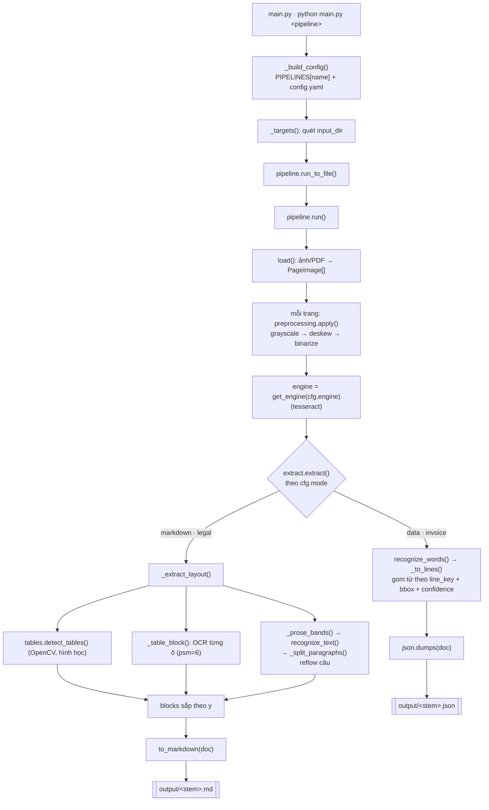

# ocr-core

Pipeline OCR dạng plugin: nạp ảnh/PDF → tiền xử lý → nhận dạng → xuất **Markdown** hoặc **JSON**.
Engine OCR và pipeline đều có thể mở rộng bằng cách thêm một entry vào registry.

## Tính năng

- Đầu vào: ảnh (`.png/.jpg/.jpeg/.tiff/.tif/.bmp`) và `.pdf` (mỗi trang → một ảnh).
- Tiền xử lý cấu hình được, theo thứ tự: `grayscale`, `deskew`, `binarize`.
- Hai chế độ trích xuất:
  - `markdown`: nhận diện **bảng có viền** (OpenCV) + **đoạn văn** ngoài bảng, reflow câu liền mạch, xuất `.md`.
  - `data`: gom từ thành dòng kèm `bbox` + `confidence`, xuất `.json`.
- Hậu xử lý (tùy chọn): sửa lỗi chính tả/dấu/khoảng trắng của text OCR bằng LLM qua OpenRouter — best-effort, mỗi trang một request, lỗi thì giữ nguyên text gốc.
- Xử lý best-effort theo từng trang: lỗi một trang không làm hỏng cả tài liệu.

## Engine hiện có

| Engine | Backend | Ghi chú |
| --- | --- | --- |
| `tesseract` | Tesseract qua `pytesseract` | Engine mặc định. Cần cài binary Tesseract (vd `brew install tesseract`). |
| `paddleocr` | PaddleOCR (PP-OCR) | Tiếng Việt mạnh, offline; **opt-in**. Cài: `pip install paddleocr paddlepaddle` (hỗ trợ 2.x & 3.x). |
| `easyocr` | EasyOCR | Đa ngôn ngữ trong một lần chạy (vd hóa đơn lẫn VI+EN), offline; **opt-in**. Cài: `pip install easyocr`. Cấu hình `langs: [vie, eng]`. |

Đăng ký engine mới tại `ocr_core/engines/__init__.py` (`_ENGINES`), implement interface `OCREngine` trong `engines/base.py`.

## Pipeline hiện có

| Pipeline | Mode | Đầu ra | Dùng cho |
| --- | --- | --- | --- |
| `legal` | `markdown` | `.md` | Văn bản hành chính/pháp lý: bảng + đoạn văn theo layout. |
| `invoice` | `data` | `.json` | Hóa đơn: dòng text kèm tọa độ & độ tin cậy. |

Thêm pipeline mới = thêm một entry vào `PIPELINES` trong `ocr_core/config.py`.

## Cài đặt

```bash
python -m venv .venv && source .venv/bin/activate
pip install -r requirements.txt
# binary hệ thống:
brew install tesseract poppler   # macOS (poppler cho pdf2image)
```

## Sử dụng

```bash
# Đặt file vào ./input rồi chạy pipeline tương ứng:
python main.py legal     # OCR mọi file trong input/ -> output/*.md
python main.py invoice   # OCR mọi file trong input/ -> output/*.json
```

`config.yaml` (tùy chọn) ghi đè default của pipeline:

```yaml
engine: tesseract
lang: vie                                   # eng | vie
preprocess_steps: [grayscale, deskew, binarize]
input_dir: ./input
output_dir: ./output
postprocess: true                           # sửa lỗi text OCR bằng LLM (OpenRouter)
```

Thứ tự ưu tiên cấu hình: **default pipeline < config.yaml < (override)**.

### Hậu xử lý LLM (tùy chọn)

Khi `postprocess: true`, mỗi trang sau khi trích xuất được gửi một request tới
OpenRouter để sửa lỗi chính tả/dấu/khoảng trắng. Cần đặt API key trong `.env`:

```bash
cp .env.example .env
# rồi điền OPENROUTER_API_KEY=... (lấy key miễn phí tại https://openrouter.ai/keys)
```

Nếu thiếu `OPENROUTER_API_KEY`, bước hậu xử lý sẽ in cảnh báo và **bỏ qua** —
text gốc được giữ nguyên. Mọi lỗi gọi API cũng fallback về text gốc (không làm
hỏng tài liệu). Hậu xử lý chỉ sửa nội dung text; `bbox` và `confidence` ở chế độ
`data` được giữ nguyên.

## Luồng hoạt động



## Cấu trúc dự án

```
main.py                  # entry point CLI: chọn & chạy pipeline
config.yaml              # override cấu hình (tùy chọn)
ocr_core/
  config.py              # Config, validate, PIPELINES (legal/invoice), load()
  pipeline.py            # load() input, run(), run_to_file(), to_markdown()
  preprocessing.py       # grayscale / deskew / binarize
  extract.py             # rẽ nhánh theo mode: layout (markdown) | lines (data)
  postprocess.py         # hậu xử lý: sửa text OCR bằng LLM (OpenRouter), tùy chọn
  tables.py              # phát hiện bảng có viền + lưới ô (chỉ hình học)
  engines/
    base.py              # interface OCREngine + kiểu Word
    tesseract.py         # engine mặc định (pytesseract)
    __init__.py          # registry get_engine()
input/                   # nguồn vào
output/                  # kết quả .md / .json
tests/                   # pytest
```

## Kiểm thử

```bash
python -m pytest -q
```
